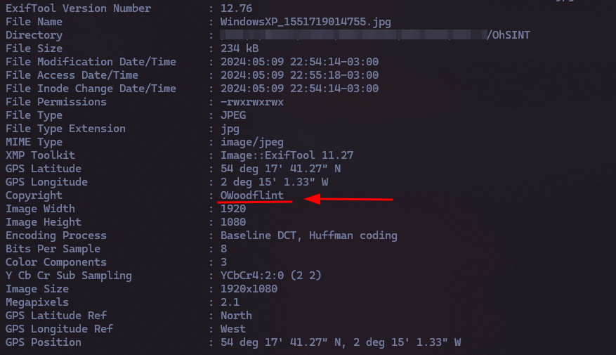

# CTF OhSINT - Passo a Passo do Meu Segundo CTF no TryHackMe

Este repositório documenta minha jornada passo a passo na resolução do CTF "OhSINT" na plataforma TryHackMe. O objetivo é compartilhar meu aprendizado e experiência, detalhando os processos e comandos utilizados para completar o desafio.

## Descrição do Desafio

O objetivo do CTF era encontrar 7 flags a partir de uma única foto. O intuito era testar as habilidades de OSINT para realizar uma busca avançada sobre as informações da foto e conseguir as flags necessárias. Foi um processo desafiador que me mostrou o quanto é possível descobrir, de forma detalhada e até mesmo assustadora, com uma simples pesquisa no Google.

## Flags a Encontrar

### 1. Qual é o avatar do usuário?

Para encontrar o avatar do usuário, primeiro foi necessário descobrir qual era o usuário que compartilhou a foto. Para isso, utilizei a ferramenta exiftool pelo terminal com o seguinte comando:

```exiftool caminho/ate/o/arquivo/WindowsXP_1551719014755.jpg ```

Após utilizar este comando, recebi o seguinte retorno:



Nessas informações, o dado mais importante que consegui foi justamente o campo que está destacado no print, o Copyright, que seria o nome de usuário do “dono” da imagem.

Após conseguir o nome do usuário, eu realizei uma pesquisa detalhada no Google utilizando dorks (inurl: OWoodflint) e encontrei o perfil do alvo no “X” (antigo Twitter). Neste perfil já consegui identificar o avatar do usuário. Um gato.

**Flag:** Cat

### 2. Qual cidade esta pessoa está?
Após descobrir o perfil do “X” do usuário, investigando suas postagens, descobri que o mesmo compartilhou um BSSID que o usuário estava usando. Utilizando a ferramenta Wigle.net (https://wigle.net/), encontrei uma referência a esse BSSID em Londres.

**Flag:** London

### 3. Qual o SSID ao qual ele se conectou?
Após ter identificado a cidade, ao aproximar mais no mapa do Wigle, consegui identificar o SSID da rede. Sendo essa UnileverWiFi.

**Flag:** UnileverWiFi

### 4. Qual o e-mail pessoal dele?
Vasculhei a imagem mais inúmeras vezes, tentando utilizar além das ferramentas anteriores, utilizando o Stegohide (https://steghide.sourceforge.net/) para tentar obter algum dado escondido no arquivo. Mas não obtive retorno significativo. Busquei de mais algumas formas até que, ao perceber na pesquisa com o Dork no Google, encontrei o GitHub do usuário alvo. Dando uma conferida no repositório “people_finder”, encontrei para contato o e-mail do usuário, sendo ele OWoodflint@gmail.com.

**Flag:**  OWoodflint@gmail.com

### 5. Em qual site foi encontrado o e-mail?
O site portanto foi no GitHub.

**Flag:** GitHub

### 6. Onde ele foi nas férias?
Para descobrir onde ele foi nas férias não foi difícil, pois no GitHub do usuário alvo possuía um link para uma página Wordpress. Acessando ela, no próprio texto de apresentação, ele informa que está em Nova York.

**Flag:** New York

### 7. Qual é a senha pessoal dele?
Agora, essa flag, por mais besta que tenha sido na minha opinião, foi a mais difícil. Vasculhei de diversas formas a imagem novamente, vasculhei o GitHub, vasculhei o “X” dele, usei o e-mail para ver se havia senhas vazadas e nada. Até que decidi vasculhar o código fonte da página de Wordpress dele. Nesse ponto, após algum tempo de depuração do código, descobri na mesma página inicial que havia a informação da cidade de Férias. Abaixo desse texto constava um parágrafo em HTML com a cor setada como branco em uma página branca. E o texto do parágrafo era a senha:

```<p style="color:#ffffff;" class="has-text-color">pennYDr0pper.!</p>```

## Considerações Finais
Este CTF foi uma experiência desafiadora e gratificante que me permitiu praticar minhas habilidades em OSINT. Através da análise de imagens, exploração de perfis e uso de ferramentas de busca avançada, fui capaz de completar o desafio e obter as sete flags.

## Agradecimentos
Agradeço à plataforma TryHackMe por oferecer este CTF e por contribuir para o meu aprendizado em segurança da informação.
